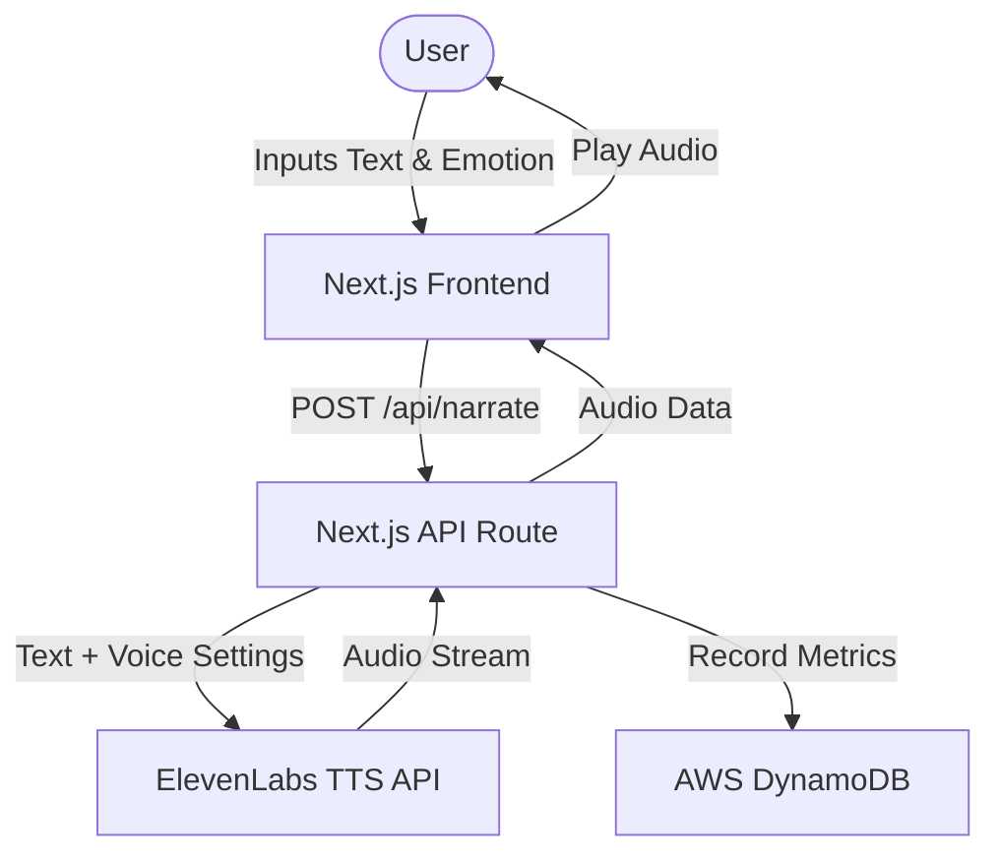

# Emo Narrator 🎙️✨

A full-stack TypeScript application that brings text to life using emotional AI voices from ElevenLabs, with request metrics stored in AWS Amplify.

## 🚀 Live URL

Here is the link to the app - https://main.d11c506w0cprcx.amplifyapp.com/ 

## 🏗️ Architecture



## 🛠️ Tech Stack
- **Frontend**: Next.js 15+ (TypeScript), Tailwind CSS, Lucide React
- **Backend**: Next.js API Routes
- **Database**: AWS DynamoDB (via Amplify Gen 2 Data)
- **Voice AI**: [ElevenLabs API](https://elevenlabs.io/)
- **Deployment**: AWS Amplify Hosting

## ⚙️ Setup Steps

### 1. Clone the repository
```bash
git clone <your-repo-url>
cd emo-narrator
```

### 2. Install dependencies
```bash
npm install
```

### 3. Configure Environment Variables
Create a `.env.local` file in the root:
```env
ELEVENLABS_API_KEY=your_api_key_here
```

### 4. Amplify Initialization (Local Sandbox)
```bash
npx ampx sandbox
```

### 5. Run Development Server
```bash
npm run dev
```

## 💰 Actual Costs (Estimation)

| Component | Tier | Cost |
|---|-|---|
| **Amplify Hosting** | Free Tier (12mo) | $0.00 |
| **ElevenLabs** | Free Tier | $0.00 (up to 10k chars/mo) |
| **AWS DynamoDB** | Free Tier | $0.00 |
| **AWS Lambda** | Free Tier | $0.00 |
| **TOTAL** | | **$0.00/mo** (within free limits) |

> [!NOTE]
> For production usage beyond free tiers, ElevenLabs costs ~$0.30 per 1,000 characters.

## 🔑 Secrets Management
For production deployment via Amplify Hosting:
1. Go to the **Amplify Console**.
2. Select your app -> **App settings** -> **Environment variables**.
3. Add `ELEVENLABS_API_KEY` with your secret key.
4. Redeploy the application.
